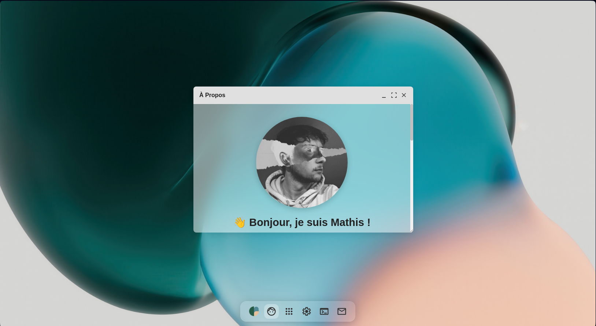

# portfoliOS

## Description
portfoliOS est un portfolio personnel moderne et réactif en cour de développement, développé en JavaScript, CSS et HTML. Il permet de présenter mes projets, mes compétences et mon parcours de manière élégante.

## Fonctionnalités
- **Design réactif** : s'adapte à toutes les tailles d'écran.
- **Défilement fluide** : navigation agréable entre les sections.
- **Présentation des projets** : mise en avant de mes réalisations.

## Aperçu

## Technologies utilisées
- **JavaScript**
- **CSS**
- **HTML**
